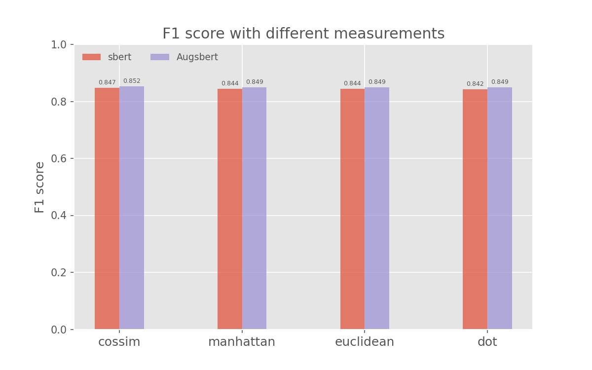

# In-Domain Results on Microsoft Research Paraphrase Corpus (mrpc) Dataset

F1 scores for binary classification are obtained through 4 different measurements.  
"sbert": the bi-encoder model is only trained on original dataset.  
"Augsbert": the bi-encoder model is trained on augmented dataset.

When the bi-encoder is trained with augmented dataset, it gets 0.5% improvement on all F1 measurements which is somehow negligible.    
This is smaller than the improvement in the paper, probably because they use **top 3** sentences in BM25, while we only use **top 2** sentences.
Also the libraries used to carry out BM25 operations are different.

    

