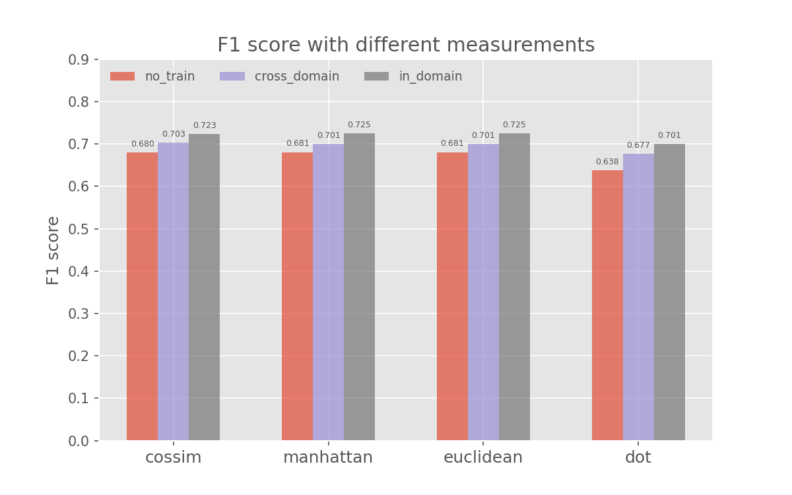

# Cross-Domain Results on Quora Question Pair (qqp) Dataset

F1 scores for binary classification are obtained through 4 different measurements.  
"no_train": the bi-encoder model is downloaded and directly used to predict the test data  
"cross_domain": some of the qqp train data are predicted by cross-encoder and then used to train the bi-encoder which is actually augmentation   
"in_domain": the bi-encoder is trained on the labeld qqp train data (*Only training on positive examples will achieve the best results*).  

Through cross_domain training, we get the result between "no_train" and "in_domain", which differs by 2% from the upper and lower one. Only 1% of qqp train data
is needed in the "cross_domain" to achieve this improvement, increasing the data size does not give any improvement.

    

