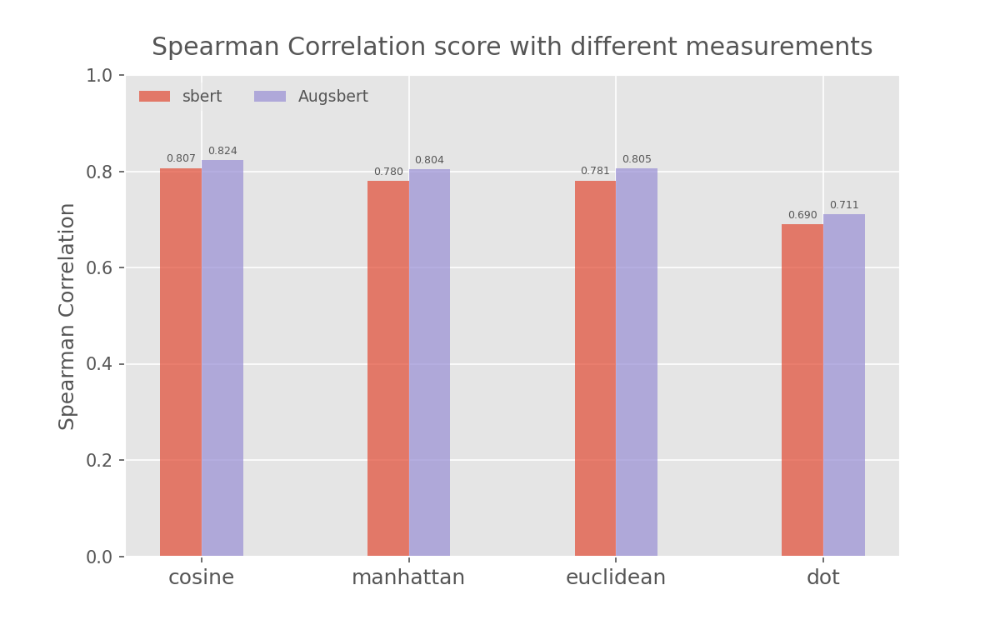

# In-Domain Results on Semantic Textual Similarity Benchmark (stsb) Dataset

Spearman Correlatrion scores for regression are obtained through 4 different measurements.  
"sbert": the bi-encoder model is only trained on original dataset.  
"Augsbert": the bi-encoder model is trained on augmented dataset.

When the bi-encoder is trained with augmented dataset, it gets 2.1% improvement on all correlation measurements which is acceptable.

    

